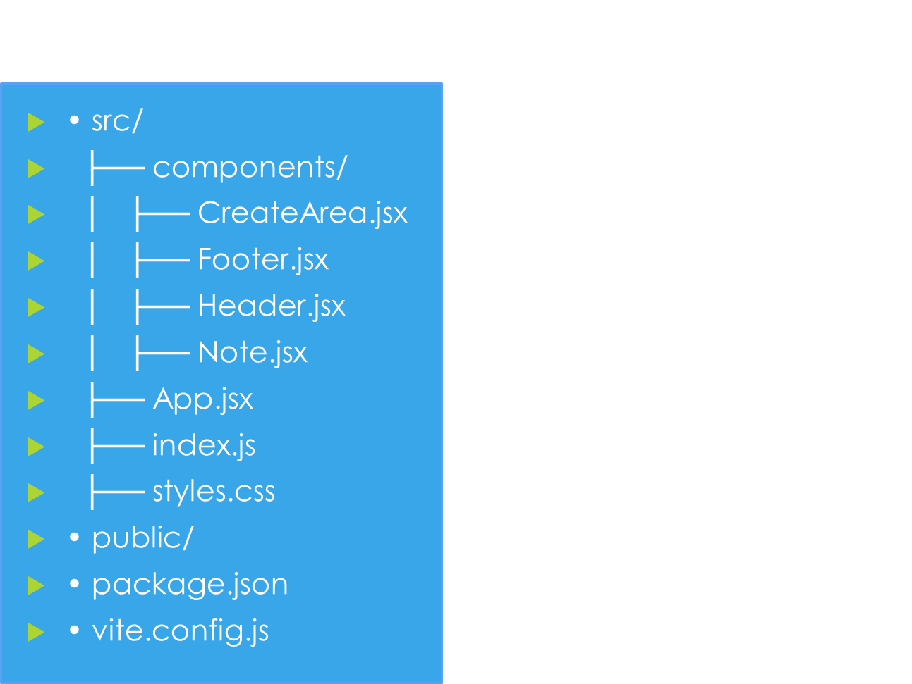
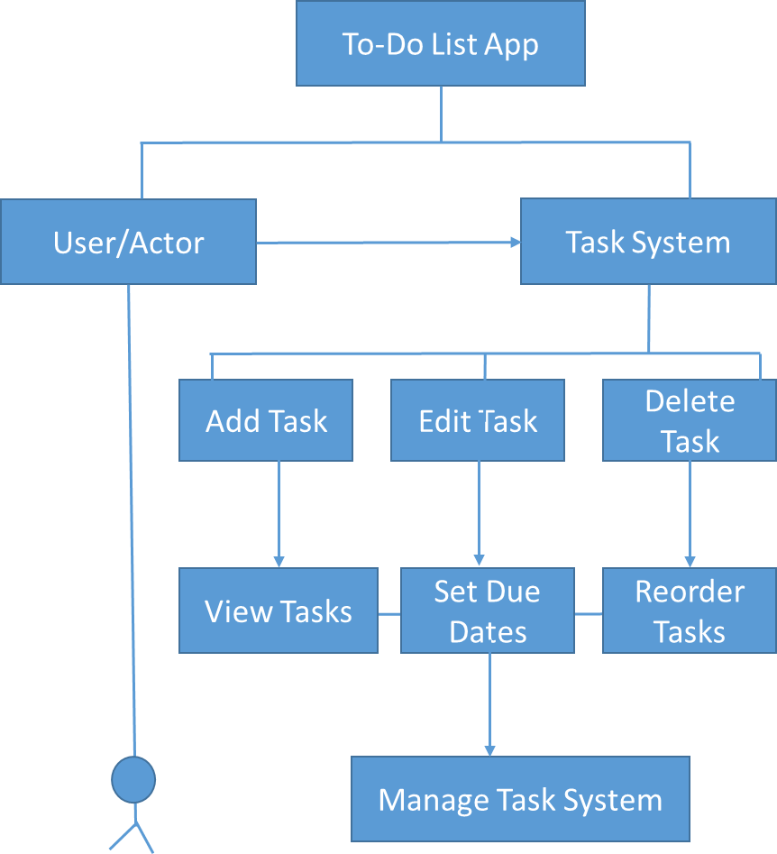

**ToDOList App**

**Project Overview**

The React-based To-Do List App is a web application that is intended for users to get their tasks done easily. Users are given the ability to add, edit, delete and organize tasks using features such as the task reordering, bulk deletion, and due date setting. Additionally, the app provides a smooth and intuitive user experience than showcasing key React functionalities like component interaction, custom hooks, state management, and conditional rendering.
This project stands as a perfect case of a flexible React application that is fully functional for the user to input their list of tasks and then be able to manipulate them. Some possible future enhancements may include advanced user authentication and Notifications.

**Features**
Add-Task: Users have the opportunity to create new tasks with a title and a brief explanation of the work needed.
Edit-Task: Users have the ability to update the details of a task previously created.
Delete-Task: Users can eliminate tasks they no longer find useful.
View-Tasks: Users might review all of their tasks, that are arranged in a list.
Set-due-Dates: Users can give tasks due dates in order to remember their tasks.
App Design: The app is entirely responsive and works on both desktop and mobile platforms.

**Technologies Used**

React: JavaScript library for building the UI.

React Router: For handling navigation (if applicable).

CSS: For styling the application.

Custom Hooks: For managing tasks and application state.

**Project Structure**

**How to Run/Deploy the Project**

Local Development

Clone the repository:

git clone https://github.com/Vonjtech/ToDoList-App.git

cd ToDoList-App

**Install dependencies:**

npm install

**Start the development server:**

npm start

Open your browser and visit http://localhost:3001 to see the app in action.

**Deployment**

I use github for version control and netlify for deployment of the app.

**Deploying on Netlify:**

Push your changes to GitHub.

Go to Netlify and create a new site from Git.

Connect your repository, and Netlify will automatically build and deploy your app.

click on the deployment button to build and deploy 

**Use Case Diagram**

Use Cases

**Adding a Task**

Scenario: A user wants to add a new task.

Action: The user enters the task title and description and clicks "Add Task".

Expected Outcome: The new task appears in the list.

**Editing a Task**

Scenario: A user needs to modify an existing task.

Action: The user selects "Edit", updates the details, and saves changes.

Expected Outcome: The task updates in the list.

**Deleting a Task**

Scenario: A user wants to remove a task.

Action: The user clicks "Delete" on a task.

Expected Outcome: The task is removed.

**Viewing Tasks**

Scenario: A user wants to review their tasks.

Action: The user accesses the task list.

Expected Outcome: All tasks are displayed.

**Reordering Tasks**

Scenario: A user wants to change the order of tasks.

Action: The user drags and drops tasks to a new order.

Expected Outcome: The task order updates.

**Setting Due Dates**

Scenario: A user wants to assign deadlines to tasks.

Action: The user selects a task and sets a due date.

Expected Outcome: The task displays its due date.

**Future Improvements**

Notifications: Alerts for upcoming due dates.

User Authentication: Allow users to log in and save tasks across devices.
